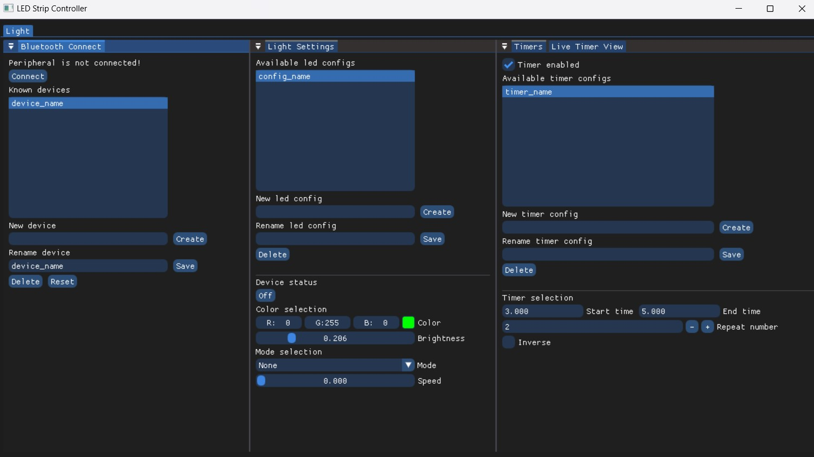

# LED STRIP APP

NOTE: `WINDOWS ONLY FOR NOW`

Purchased an LED Strip from Ali Express that had an app to control it called "Happy Lighting". Since I didn't want to use it and the led strip was attached to my workstation table, I decided to write this simple windows app/program to control the LED. `It's stil WIP as far as cleanup and UI improvements go`, but it works fine and can do the following:

- Scan and connect to several devices
- Change and select light configuration for each device (on/off, color, brightness, mode)
- Change and select timer configuration for each device (start, end, repeat, inverse)
- Start, pause, unpause, and reset global timer and live view existing timer configurations
- Save/load all settings when closing/opening app

Built with:
- ImGui for UI and ImPlot for plotting
- Uses Win32 and Dx3d for window and graphics respectively
- SimpleBLE for bluetooth

There is an exe available if you just want to use the app, however feel free to build the project yourself:
- Download Visual Studio, setup as per c++ development
- Clone repo, open .sln file and build the project. Output will be a folder called bin/{PLATFORM}{CONFIGURATION}/

NOTE: `To get device name use nRF Connect app (android and iOS) and scan, find your device and use that name`

